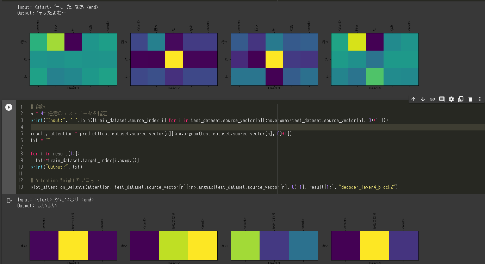

# Hogen
 方言翻訳機のうち公開可能な部分

## 使用上の注意
方言コーパスの指定があります。ただしフォーマットを規定通りに揃えれば、あらゆる方言コーパスに適用できるはずです。

また、コーパスに記載されているガイドラインに従ったうえでのご利用をお願い致します。

## フォルダ構成

+ _OLD : 要らないファイルですが、使い道があればと思い残したものたちです
+ checkpoints_EX : Tensorチェックポイント保管用フォルダです。参考元のmodelに傷を付けないよう切り離しを行いました。
+ hogen_sentences : 方言アライメントのサンプルを置いています。
+ jpn_sentences : 日本語アライメントを置いています。ライセンスが別で存在します（CC-BY 2.0 (France)）。利用時には注意が必要です。
+ DATA : 使うアライメントはこちらに移動させてください。

## ファイル説明
+ kana_SUDACHI.ipynb
CSVを読み込み、特定の列のカタカナをひらがなに変換します。
+ Train_on_GPU_HIRA.ipynb
翻訳学習ファイル。
+ Predict_on_GPU_HIRA_UNK.ipynb
翻訳予測ファイル。

## 参考リポジトリ
[kawasaki-kento/Transformer](https://github.com/kawasaki-kento/Transformer)
[sonoisa/t5-japanese: 日本語T5モデル](https://github.com/sonoisa/t5-japanese)

### 翻訳結果の一例

